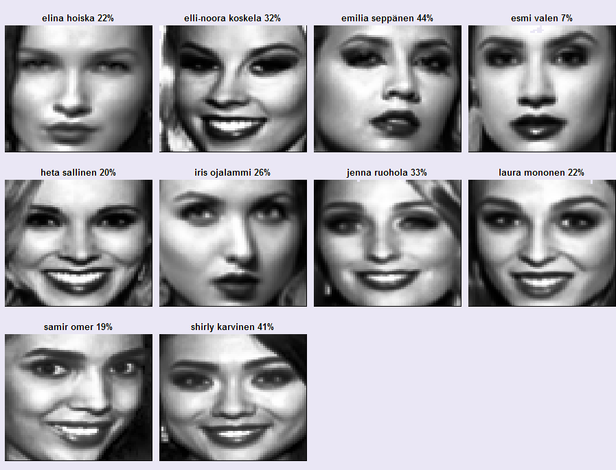

```{r setup, include=FALSE, results = "hide"}
knitr::opts_chunk$set(echo = TRUE)

# install.packages("IM")
# install.packages("LiblineaR")
```

<br>
*The repository of this GitHub page is [here](https://github.com/TuomoNieminen/BeautyFaces)*
<br>

# Miss finland competition

This GitHub web page provides a summary of a statistical analysis related to the Miss Finland beauty contest. The page introduces methods used to predict the winners of the 2016 Miss Finland competition, using data from contestents faces, body measurements and demographic information. The analysis is based on methods of dimensionality reduction, binary classification, cross-validation and ensemble learning. 



*Predictions for the 2016 Miss Finland competition. The predictions are a result of stratistical learning, where data from past competitors and competitions were used to predict future results. The percentages give the probabilities for the 2016 contestents to reach the top 3 of the competition, based on their body measurements, eigenfaces (an approximation of their head shot) and demographic information.*

# tyyppiarvo.com Miss Finland Challenge

Miss Finland is a beauty contest held annually in Finland. During the spring of 2016, as the head of news for the tyyppiarvo.com magazine, I presented an open challenge to forecast the winner of the competition using statistical analysis. 

Earlier during the spring, the whole editorial staff and other volunteers involved with tyyppiarvo.com had gone through a tremendous effort of collecting and editing pictures of past competotitors to enable to competition. Specially the following people deserve thanks: 

- **Joni Oksanen** provided a template to make it easier to modify the pictures to be as similar to each other as possible.
- **Tommi Mäklin** went trough the trouble of finding suitable R functions to transform the pictures to machine-readable numerical vectors, and also provided some helpful plotting functions. We also received help from
- **Mika Sutela**, a researcher at the University of Eastern Finland, who had access to a dataset of measurements and demograpchic information of past competitors.
- Everyone who helped collect the data

I combined the two data set to form a competition data, which included both the demographic and past competition results, as well as pictures of the competitors faces. The data also included information on the competitors of the not yet held Mis Finland 2016.

In this page I will introduce and explain my own solution and submission to the competition, which ended up being the winning submission.  


# A summary of my solution

My solution involved the following steps:

**1 Perform histogram equalisation on the images**

- This was done to reduce the effect of image lighting. I also experimented with binarizing the greyscale images to simple black / white.

**2 Reduce the dimensionality of the data with Principal Components Analysis (PCA)**

- The images can be thought of as long numerical vectors, meaning that there is a huge amount of features describing each competitor. PCA captures the most essential information in a lesser number of features.

**3 Use regularized logistic regression to learn a predictive statistical model**

- Logistic regression is a form of generalized linear regression where the goal is to learn a linear model to predict the probabilities of a binary outcome. Even after PCA the data still had more features than observations though, which will usually result in overfitting on the training data. 
- I chose to use *regularization* to further reduce the number of predictors in the regression model. Regularisation essentially forces some of the weights of the predictors to zero, removing their effect from the model. This can help to fight overfitting.

**4 Do cross-validation with multiple models and form an essamble from the best performing ones**

- The regularisation of the previous step can be calibrated. To finnish the model, I chose to do cross-validation to try to find good parameters for the regularisation. I then averaged the predictions of the top 20% performing models to make the final predictions.  


# The competition data


The data used in this analysis lives in the [repository](https://github.com/TuomoNieminen/BeautyFaces).  

```{r load_data}
missdata <- read.csv("Data/challenge_data.csv", 
                     encoding="UTF-8", stringsAsFactors = F)

```

## Dimensionality

The data is very high dimensional, including both demographic information and the pictures of each competitor. The pictures are greyscale images with 64 x 64 pixels. From a computational point of view, they are essentially matrices. Each entry in the matrix represents the amount of grey in the pixel.  

```{r dimensions}
NR <- nrow(missdata)
NC <- ncol(missdata)
c(rows=NR,columns=NC)
```

The pictures can also be represented by a vector of length 64 x 64 = 4096 which is what was done in the data. The data also included 18 other variables (including placements in the Miss finland competition) resulting in 4114 variables total. 

```{r}
names(missdata)[1:18]
```


## Variable descriptions

Explanations of all the variables is below:

- Miss = Winner Miss Finland (1="yes", 0="no")
- PP = placed 2-3 (1="yes", 0="no")
- Kolme = placed in top three
- Lehd = Press choice
- Yleiso = Crowd favourite
- Ika = Age
- Pituus = Height
- Paino = Weight
- Rinta = Chest
- Vyötärö = Waist
- Lantio = Hips
- Hius = blond/brunette (0 = brunette, 1=blond)
- AsuinP = Location of recidence (0=E-Suomi, 1=K-Suomi, 2=P-Suomi)
- Nro = Competition number (0=1-5, 1=6-10)
- Turku = From Turku (1="yes", 0="no")
- Hki = From Helsinki (1="yes", 0="no")
- V1 - V4096 = A flattened greyscale picture matrix of the contestents face (64x64). Each variable denotes the amount of grey in a single pixel.

The data also includes the 2016 competitors for whom naturally some of the data was missing. 

# Exploring and visualizing the data

This analysis uses the R libraries visible below. The helper functions used in the analysis can be found in the [GitHub repository](https://github.com/TuomoNieminen/BeautyFaces/blob/master/missR.R) related to this page. The abnalysis also uses the R packages LiblineaR, IM and dplyr.

```{r, message = F}
library(LiblineaR)
source("missR.R")
library(IM)
library(dplyr)
```

The columns in the positions 19 to 4114 of the compettions data frame include the picture vectors. 

```{r}
# faces
rownames(missdata) <- paste0(missdata$name, " (",missdata$year,")")
faces <- as.matrix(missdata[,19:NC, drop = F])
```

## Visualizing the face vectors

The `drawFace()` helper function draws a face represented by a vector. It is a wrapper for `image()` in R. Let's look at an example face chosen by random: 

```{r randomface, fig.cap = "A randomly selected face from the competition data"}
randomface <- faces[sample(1:NR,1),, drop = F]
drawFace(randomface)
```
<br>
We can also visualize all of the 2016 competitors

```{r competitors2016, fig.cap = "The 2016 Miss Finland competitors"}
# visualize the 2016 competitors
miss2016 <- faces[missdata$year==2016,,drop = F]
drawMultipleFaces(miss2016)
```

<br>
We can also do fun things such as draw some average faces. It is quite straightforward to compute a simple average of the face vectors. This allows us to visualize for example an average perintoprinsessa! (placed 2-3 in the competitions).


```{r}
meanface <- function(face_matrix) {
  colSums(face_matrix) / nrow(face_matrix)
}
```

```{r average_perinto, fig.cap = "A visualisation of the average 2-3 place finisher in Miss Finland compatition"}
# visualize the average perintoprinsessa (places 2-3)
PPs <- subset(faces, missdata$PP==1)
meanPP <- meanface(PPs)
drawFace(meanPP)
```
<br>

## Histogram equalisation and binarizing

The pictures are originally quite similar but if we're going to compare them to each other and do statistical analysis, we should make sure that the competitors are really represented as equally as possible.  

One of the things to concider is the lighting of the pictures. We can perform histogram equalisation to make an effort to nullify the effect of lighting.  

```{r histeq, fig.cap = "A sample of faces after histogram equalisation"}
# perform histogram equalisation to all images
eq_faces <- apply(faces,1, IM::histeq)
eq_faces <- t(round(eq_faces))
drawSample(eq_faces)
```
<br>

We could also binarize the images by choosing a treshold and simply coding the pictures as "black" and "white". What would that look like?

```{r, binarize, fig.cap = "A sample of binarized Miss Finland competitor faces"}
#  furthed simplify pics by "binarizing" 
co <- 130
bi_faces <- eq_faces
bi_faces[bi_faces <= co] <- 0
bi_faces[co < bi_faces] <- 256

drawSample(bi_faces)
```
<br>

That's pretty artsy. 

We could also take a look at some averages again. Here is the average of all the histogram equalised faces.

```{r average_eq, fig.cap = "The average competitor after the histogram equalisation"}
drawFace(meanface(eq_faces))
```
<br>

And here is the average of the binarized faces.

```{r average_bi, fig.cap = "The average competitor after binarizing the images"}
drawFace(meanface(bi_faces))
```
<br>


Right now, there are over 4000 variables related to each competitior. That is way too much for predicting. Next, we'll make an effort to reduce the dimensionality of the data.

# Dimensionality reduction with PCA

The `prcomp()` function in the stats package perform Principal Component Analysis (PCA), utilizing the Singular Value Decomposition (SVD). It is a fast algorith an according to my understanding the solution is somewhat approximate. The object returned by the function has a print method which allows us to see the proportions of variance captured by the principal components. 

## Variability captured

The summary shows that 86 Principal components are needed to capture 99% of the variance in the original data. 86 is a lot but it is a lot less than 4096!

```{r}
eq_pca <- prcomp(eq_faces)
s <- summary(eq_pca)
df <- data.frame(t(s$importance))
df$PC <- rownames(df)
df
```

## Eigenfaces

When we have the principal components solution, we can use it as a projection to create a lower dimension representation of any image. We can also do another projection to represent the picture in it's original dimensions but with the more economial principal component solution. These are sometimes called eigenfaces, because the PCA representation is given by *eigenvalues*.

Let's draw for example a PCA representation of Shirly Karvinen using the 50 first principal components.

```{r, fig.cap = "Shirly Karvinen eigenface representation using 50 principal components"}
PC <- eq_pca$rotation
shirly <- faces["shirly karvinen (2016)",]
which <- 1:50

V <- PC[,which]
pc_shirly <- shirly %*% V
new_shirly <- pc_shirly %*% t(V)

drawFace(new_shirly)
```
<br>

I also wrote some helper functions to perform the above routine and compare the appearance of couple random faces with their lower dimensional representations. We saw from the summary that the first 86 Principal components are enough to capture 99% of the total variance in the data. So, let's start with that.

```{r, fig.cap = "Comparison of two original pictures and eigenface representations using the first 86 principal components"}
compare_faces(eq_faces, PC, which = 1:86, n = 2)
```
<br>

To capture about 90% of the total variance we can use the first 50 principal components, which would look like this:

```{r, fig.cap = "Comparison of two original pictures and eigenface representations using the first 50 principal components"}
compare_faces(eq_faces, PC, which = 1:50, n = 2)
```
<br>

To capture about half of the variace we could use the first 7 PC:  

```{r, fig.cap = "Comparison of two original pictures and eigenface representations using the first 7 principal components"}
compare_faces(eq_faces, PC, which = 1:7, n = 2)
```
<br>

In theory, using all of the principal components gives the original picture. However the prcomp function in R gives an approximate solution to the PCA problem so this is not exactly true. You can write your own function to compute a more exact solution but that is probably pretty slow (see missR.R for a function that does this) .


Next, we'll use logistic regression together with penalization and cross-validation techniques to predict the top 3! 


# Penalized logistic regression

Logistic regression is a form of generalized linear regression where the goal is to learn a linear model to predict the probabilities of a binary outcome. Even after PCA the data still had more features than observations, which will usually result in overfitting on the training data. 

I chose to use *l1 regularization* to further reduce the number of predictors in the regression model. Regularisation essentially forces some of the weights of the predictors to zero, removing their effect from the model. This can help to fight overfitting.

Lastly, the regularisation can be calibrated. To finnish the model, I chose to do cross-validation to try to find good parameters for the regularisation. I then averaged the predictions of the top 20% performing models to make the final predictions.  

## Targeting the years

The goal is to predict the winners of the 2016 compotetition using data from the past competitions.  

```{r}
data <- cbind(missdata[,1:18], eq_faces)
train_data <- subset(data, year < 2016)
target_data <- subset(data, year == 2016)
PC <- eq_pca$rotation
face_dimensions <- 1:86
```


To accomplish this I used l1 regularized logistic regression, using different values for the cost parameter as welel as different eigenfave representations and studied which choices yielded the best results. To select the optimal parameters I chose a cross-validation method were the cross-validation was performed by year: each round of cross-validation one competition yer was set aside as the testing group. The model was then fit with rest of the data and tested on the test year data. 

I defined the cost function to be the accuracy of correctly predicting the top three competitors for each yer. I gave the model some slack and compared the top 4 predictions of the model to the actual top 3.  

```{r}

# parameter grid for cross validation
costs <- c(0.01,0.1,1,10,1e2,1e4,1e7)

# returns a matrix containing avarage prct of correct predictions
# target is either "Miss" for winner predictions, or "Kolme" for top3 predictions
# winner predictions might not be very reliable since there is so little data
results <- cross_validate_grid(data = train_data, PC = PC, 
                               C = costs, FD = face_dimensions, target = "Kolme")
```

The helper function `cross_validate_grid()` combines the above described strategy and returns a matrix describing the accuracy achieved with each parameter combination. Using this matrix, I then selected the top 20% performing parameter combinations. 

The table below shows which cost and eigenface dimensionality (facedim) were in the top 20% when measured by their accuracy in the cross-validation rounds.  

```{r}

best_predictors <- which(results > quantile(results, probs=0.8), arr.ind = T)
chosen_costs <- costs[best_predictors[,2]]
chosen_facedims <- face_dimensions[best_predictors[,1]]

data.frame(cost = chosen_costs, facedims = chosen_facedims, accuracy = results[best_predictors])
```

## Creating an ensamble and predicting 

After finding the optional cost and facedim parameters, I  predicted the 2016 results using again the same l1 regularized losigtic regression with each of the best cost and facedim combinations.  I wrote a wrapper function which uses `LiblineaR::LiblineaR` to do the predicting. The result of this function is a probability matrix, where each row represents a competitor and the columns are the predicted probabilities of getting to the top 3 of the competition, outputted by the different parameter choices.

```{r}
prob_matrix <- fit_l1_logreg(tr_data = train_data, PC = PC, costs = chosen_costs, 
                            facedims = chosen_facedims, target_data = target_data,
                            target = "Kolme")
```

Finally I averaged the predictions gien by the different logistic regression models to get the final predictions.  

```{r}
top3prob <- rowMeans(prob_matrix)
names(top3prob) <- target_data$name
P <- data.frame(top3prob)
P[order(-P),, drop = F]
```

## Plotting the predictions

We can also now plot the competitions and their top3 percentages:  


```{r}

pred_labels <- paste0(target_data$name," ", 100*round(top3prob,2),"%")
faces2016 <- target_data[,19:ncol(target_data)]
drawMultipleFaces(faces2016, titles = pred_labels, cex = 1.3)

```

```{r, include = F, eval = F}
dev <- function() png(file="top3_prediction.png", height = 900, width = 900)
drawMultipleFaces(faces2016, titles = pred_labels, dev=dev, cex = 1.4)
dev.off()
```

# Results  

2 of the predictions of my model turned out to be correct. Shirly Karvinen won the competition and Emilia Seppänen was in the top 3. The actual top3 also had Heta Sallinen in second place.  

<hr>
