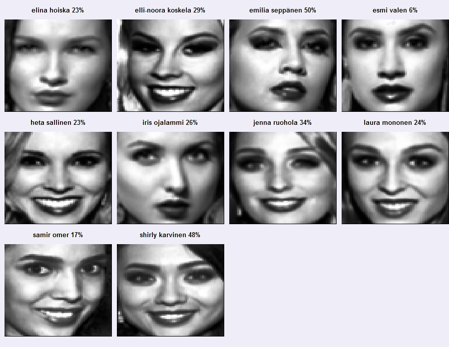

```{r setup, include=FALSE, results = "hide"}
knitr::opts_chunk$set(echo = TRUE)

# install.packages("IM")
# install.packages("LiblineaR")
options(scipen = 10)
set.seed(333)
```

<br>



*Predictions for the 2016 Miss Finland competition. The predictions are a result of statistical learning, where data from past competitors and competitions were used to predict future results. The percentages give the probabilities for the 2016 contestents to reach the top 3 of the competition, based on their body measurements, eigenfaces (a mathematical approximation of their head shot) and demographic information.*


# Welcome 

This GitHub web page provides a summary of a statistical analysis related to the Miss Finland beauty contest. The page introduces methods used to predict the winners of the 2016 Miss Finland competition, using data from contestents faces, body measurements and demographic information. The analysis is based on methods of dimensionality reduction, binary classification, cross-validation and ensemble learning. 

The repository of this GitHub page is [here](https://github.com/TuomoNieminen/BeautyFaces) and an article describing the analysis in finnish is [here](http://tyyppiarvo.com/2016/09/kuka-on-heista-kaikkein-kaunein-nain-syntyi-tyyppiarvon-kilpailun-voittanut-missiennustus/).


# tyyppiarvo.com Miss Finland -challenge

Miss Finland is a beauty contest held annually in Finland. During the spring of 2016, as the head of news for the tyyppiarvo.com magazine, I presented an open challenge to our readers to predict the winner of the 2016 Miss Finland competition using statistical analysis. The following people deserve thanks for enabling the competition: 

- **Joni Oksanen** provided a template to make it easier to modify the pictures to be as similar to each other as possible.
- **Tommi Mäklin** went trough the trouble of finding suitable R functions to transform the pictures to machine-readable numerical vectors, and also provided some helpful plotting functions.
- **Mika Sutela** provided a dataset of measurements and demograpchic information of past competitors.
- Volunteers at Tyyppiarvo who helped collect head shots of Miss Finland competitors.

On this page I will introduce and explain my own solution and submission to the competition, which ended up being the winning submission.  

# The competition data

The competition data was formed by combining the image data collected by Tyyppiarvo staff with the data provided by Mika Sutela. The competition data included demographic information, body measurements, past competition results and numeric vectors representing greyscale pictures of the competitors faces. The data also included the (then future) 2016 competitors. 

```{r load_data}
missdata <- read.csv("Data/challenge_data.csv", 
                     encoding="UTF-8", stringsAsFactors = F)

```

## Dimensionality

The data is very high dimensional due to including a picture of each competitors face. The pictures are greyscale 64 x 64 (= 4096) pixel images. From a computational point of view the pictures are vectors where each entry is an integer representing the amount of grey in the matching pixel.


```{r dimensions}
NR <- nrow(missdata)
NC <- ncol(missdata)
c(rows=NR,columns=NC)
```


## Feature descriptions

The data includes the following features:

- Miss = Winner Miss Finland (1="yes", 0="no")
- PP = placed 2-3 (1="yes", 0="no")
- Kolme = placed in top three
- Lehd = Press choice
- Yleiso = Crowd favourite
- Ika = Age
- Pituus = Height
- Paino = Weight
- Rinta = Chest
- Vyötärö = Waist
- Lantio = Hips
- Hius = blond/brunette (0 = brunette, 1=blond)
- AsuinP = Location of recidence (0=E-Suomi, 1=K-Suomi, 2=P-Suomi)
- Nro = Competition number (0=1-5, 1=6-10)
- Turku = From Turku (1="yes", 0="no")
- Hki = From Helsinki (1="yes", 0="no")
- V1 - V4096 = A flattened greyscale picture matrix of the contestents face (64x64). Each variable denotes the amount of grey in a single pixel.

# A summary of my solution

The goal was to predict the winners of the Miss Finland 2016 competition, based on the high dimensional competition data. My solution involves the following steps:

1. Equalize the light of the images. 
2. Reduce the dimensionality of the data with Principal Components Analysis (PCA)
3. Use regularized logistic regression to learn a sparse predictive model
4. Do cross-validation with multiple models and form an ensemble from the best performing ones
5. Average the predictions of the ensemble to make the final predictions

# Looking at the data

```{r, message = F}
library(LiblineaR)
source("missR.R")
library(IM)
library(dplyr)

rownames(missdata) <- paste0(missdata$name, " (",missdata$year,")")
faces <- as.matrix(missdata[,19:NC, drop = F])
```

## A random face

```{r randomface, fig.cap = "A randomly selected face from the competition data"}
randomface <- faces[sample(1:NR,1),, drop = F]
drawFace(randomface)
```
<br>

## The average 2-3 finisher

```{r average_perinto, fig.cap = "A visualisation of the average 2-3 place finisher in Miss Finland competition"}
# visualize the average perintoprinsessa ('PP', places 2-3)
PPs <- subset(faces, missdata$PP==1)
colMeans(PPs) %>% drawFace
```
<br>

## The 2016 competitors

```{r competitors2016, fig.width = 8, fig.height = 8}
# visualize the 2016 competitors
miss2016 <- faces[missdata$year==2016,,drop = F]
drawMultipleFaces(miss2016)
```


# Histogram equalization and binarizing

Histogram equalization can help to nullify the effect of different lighting and contrast in the pictures. We could also binarize the images by choosing a treshold and simply coding the pictures as "black" and "white". What would that look like?

## A sample of equalized faces

```{r histeq, fig.width = 7, fig.height = 7, fig.cap = "A sample of faces after histogram equalization"}
# perform histogram equalisation to all images
eq_faces <- apply(faces,1, IM::histeq)
eq_faces <- t(round(eq_faces))
drawSample(eq_faces)
```
<br>

## A sample of binarized faces

```{r, binarize, fig.width = 7, fig.height = 7, fig.cap = "A sample of binarized Miss Finland competitor faces"}
#  furthed simplify pics by "binarizing" 
co <- 130
bi_faces <- eq_faces
bi_faces[bi_faces <= co] <- 0
bi_faces[co < bi_faces] <- 256

drawSample(bi_faces)
```
<br>

That's pretty artsy.

## The average face

```{r average_eq, fig.cap = "The average competitor after the histogram equalisation"}
colMeans(eq_faces) %>% drawFace
```
<br>

## The average binarized face

```{r average_bi, fig.cap = "The average competitor after binarizing the images"}
colMeans(bi_faces) %>% drawFace
```
<br>


# Dimensionality reduction with PCA

Right now, there are over 4000 variables related to each competitor. Next, we'll reduce the dimensionality of the data with Principal Component Analysis (PCA).

## Variability captured by the PC's

```{r}
eq_pca <- prcomp(eq_faces)
PC <- eq_pca$rotation

s <- summary(eq_pca)
df <- data.frame(t(s$importance))
df$PC <- rownames(df)
df
```

*A summary of principal component analysis performed with the prcomp() function. The summary shows that 86 Principal components are needed to capture 99% of the variance in the original data. 86 is a lot but it is a lot less than 4096!*


## A sample of 99% eigenfaces  

```{r, fig.width = 7, fig.height = 7, fig.cap = "Comparison of two original pictures and eigenface representations using the first 86 principal components. The first 86 PC's capture 99% of the variance in the data."}
compare_faces(eq_faces, PC, which = 1:86, n = 2)
```
<br>

## A sample of 90% eigenfaces

```{r, fig.width = 7, fig.height = 7, fig.cap = "Comparison of two original pictures and eigenface representations using the first 50 principal components. The first 50 PC's capture 90% of the total variance in the data."}
compare_faces(eq_faces, PC, which = 1:50, n = 2)
```
<br>

## A sample of 50% eigenfaces

```{r, fig.width = 7, fig.height = 7, fig.cap = "Comparison of two original pictures and eigenface representations using the first 7 principal components. The first 7 PC's capture 50% of the total variance in the data."}
compare_faces(eq_faces, PC, which = 1:7, n = 2)
```
<br>


# Predicting the top 3 with logistic regression

After PCA the data still had more features than observations, which will usually result in overfitting on the training data. I used *l1 regularization* to further reduce the number of predictors. Logistic regression was used to make preditions.

```{r}
data <- cbind(missdata[,1:18], eq_faces)
train_data <- subset(data, year < 2016)
target_data <- subset(data, year == 2016)
PC <- eq_pca$rotation
face_dimensions <- 1:86
```

## Cross-validating the models by year

The regularisation can be calibrated and it might not be optimal to include most of the principal components. I used cross-validation to find the best performing parameters for the regularisation and the best number of PC components to use as predictors. During each round of cross-validation, a single competition year was set aside as the testing group. The model was then fit with rest of the data and it's predictive power tested on the test year data. 

```{r}

# parameter grid for cross validation
costs <- c(0.01,0.1,1,10,1e2,1e4,1e7)

# returns a matrix containing avarage prct of correct predictions
# target is either "Miss" for winner predictions, or "Kolme" for top3 predictions
# winner predictions might not be very reliable since there is so little data
results <- cross_validate_grid(data = train_data, PC = PC, 
                               C = costs, FD = face_dimensions, target = "Kolme")

best_predictors <- which(results > quantile(results, probs=0.8), arr.ind = T)
chosen_costs <- costs[best_predictors[,2]]
chosen_facedims <- face_dimensions[best_predictors[,1]]

data.frame(cost = chosen_costs, facedims = chosen_facedims, accuracy = results[best_predictors])

```

*The regularisation costs and eigenface dimensionalities (facedim) of the top 20% performing logistic regression models, when measured by their accuracy in the cross-validation rounds.*

<br>

## Creating an ensemble 

I created an ensemble from the top 20% performing models. The distributions of the weights related to each feature in the data are given below.  
```{r}
res <- fit_l1_logreg(tr_data = train_data, PC = PC, costs = chosen_costs, 
                            facedims = chosen_facedims, target_data = target_data,
                            target = "Kolme")
w_summaries <- do.call(cbind, lapply(data.frame(res$weights), summary)) %>% t %>% data.frame
w_summaries$feature <- rownames(w_summaries)
w_summaries
```

*The distribution of weights for each feature in the data, learned using the top 20% performing l1 reguralized logistic regressio models. The negative value of the AsuinP feature tells us that the winners are most often from the southern part of Finland compared to the middle or northern parts. The competitors who do well are not usually from Helsinki though and you might be better off if you hail from Turku instead. All of the 'curviness' features vyotaro (waist), rinta ( chest), lantio (hips) as well as pituus (height) have on average small positive weights associated to them.*  

<br>


## Final prediction probabilites

To get the final predictions, I averaged the predictions of the different models to get a single probability value for each competitor.

```{r}
top3prob <- rowMeans(res$probs)
names(top3prob) <- target_data$name
P <- data.frame(top3prob)
P[order(-P),, drop = F]
```

*Predictions for the 2016 Miss Finland competition as probabilities of reaching the top 3. The statistical model predicts Shirly Karvinen and Emilia Seppänen as the favourites.*

<br>

## Final prediction percentages

```{r faces2016_predictions, fig.width  = 8, fig.height  = 8}

pred_labels <- paste0(target_data$name," ", 100*round(top3prob,2),"%")
faces2016 <- target_data[,19:ncol(target_data)]
drawMultipleFaces(faces2016, titles = pred_labels, cex = 1.2)
```

```{r, include = F, eval = F}
dev <- function() png(file="top3_prediction.png", height = 900, width = 900)
drawMultipleFaces(faces2016, titles = pred_labels, dev=dev, cex = 1.4)
dev.off()
```

<br>

# Results  

Two of the predictions of my model turned out to be correct. Shirly Karvinen won the competition and Emilia Seppänen was in the top 3. The actual top3 also had Heta Sallinen in second place.  

<hr>
